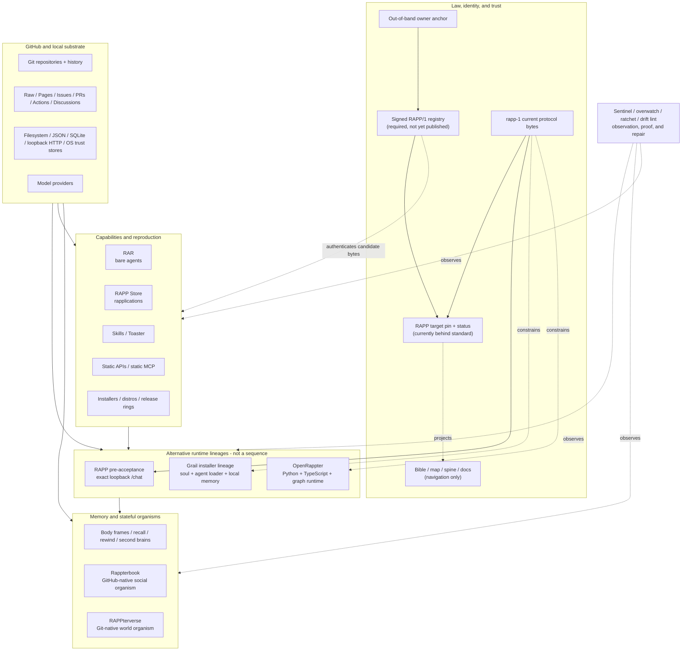

# RAPP organism architecture

**Status:** first whole-estate architecture, grounded in the repository
snapshot captured on 2026-08-23.

RAPP is not one application and it is not one repository. It is a federated
organism made from protocols, runtimes, registries, persistent state, social
worlds, distribution channels, operator surfaces, and immune systems. The
repositories under `repos/` are its organs. This monorepo is the first
point-in-time anatomical specimen that puts those organs together.

The editable system diagram is
[`architecture/rapp-organism.excalidraw`](architecture/rapp-organism.excalidraw).

## 1. Architectural thesis

RAPP has five architectural scales:

| Scale | Meaning |
|---|---|
| **Organism** | The complete declared public estate represented by the repositories in this snapshot after applying `ORGANISM.json`'s explicit scope exclusions. It is an ecosystem, not one deployable process. |
| **Protocol organism** | In RAPP/1, a running brainstem with persistent identity. This is the narrower normative use of "organism." |
| **Organ** | A repository or tightly coupled repository family with one bounded responsibility: runtime, registry, memory, world, surface, distribution, or observation. |
| **Cell / agent** | The smallest independently executable capability, usually a `*_agent.py` or TypeScript equivalent with metadata and a `perform()`/`execute()` contract. |
| **Substrate** | Git and GitHub, raw content and Pages, Issues/PRs/Actions/Discussions, local filesystems, loopback processes, operating-system facilities, and model providers. |

The organism has one overriding protocol invariant:

> The same concept has the same canonical bytes everywhere, and a higher layer
> may not redefine a lower layer.

That rule comes from the normative
[`rapp-1` specification](repos/rapp-1/SPEC.md#L18-L34). It is also the reason
this snapshot records exact upstream commits and verifies the Git tree that it
publishes.

## 2. Boundary and evidence

This architecture separates four facts that must not be collapsed:

1. The GitHub owner had **435 public repositories** when audited.
2. A broad `rapp|brainstem|twin|wildhaven` family search matched **243** of
   them.
3. The stricter public, non-archived, exact name-pattern candidate rule matched
   **199** repositories.
4. Two machine-recorded exclusions left **197 repositories, 33,239 files, and
   571 MB** in the captured organism
   ([`INDEX.md`](INDEX.md#L1-L8)).

The exclusions are `kody-w/rapp-monorepo`, which cannot recursively capture
itself as a point-in-time specimen, and `kody-w/rapp-shape-aibast`, which is an
external AIBAST library-layout staging rehearsal rather than an organism organ.
Both are records in `ORGANISM.json`, not silent omissions. The 46-repository
difference between broad search and the final specimen therefore combines a
different candidate predicate with these two explicit scope decisions.

The snapshot is:

- a read-only specimen at pinned upstream commits;
- an offline whole-body view;
- evidence that can be traced back to each source repository.

The snapshot is not:

- a runtime or deployable brainstem;
- the RAPP/1 protocol authority;
- an authenticated estate registry;
- a replacement for source repository history;
- proof that a repository is current, supported, or safe.

Large files may be skipped and sensitive files may be withheld. Both are named
in [`INDEX.md`](INDEX.md), and the source repository remains authoritative.

### 2.1 Lifecycle vocabulary

`ORGANISM.json` lifecycle values are closed vocabularies enforced by
`Organism`:

| Dimension | Allowed values |
|---|---|
| System lifecycle | `mixed-snapshot`, `generated-snapshot`, `historical-or-retired`, `experimental-or-incubating`, `unclassified-incubator` |
| Projection lifecycle | `active-but-observation-stale`, `active-but-incomplete` |
| Product lifecycle | `active`, `retired` |
| Target-record currency | `current-aligned`, `current-but-drifted`, `historical` |

Product lifecycle and record currency are independent dimensions. In
particular, a current status record for a retired product does not make that
product current.

## 3. Authority hierarchy

Authority is explicit and directional. A repository name such as "Bible,"
"registry," "stable," or "canonical" does not create authority.

| Rank | Authority | Rule |
|---|---|---|
| 1 | Exact current `rapp-1` specification bytes | Normative protocol authority. The last specification-changing commit is `d2cd5ab`; the current bytes are 41,952 bytes with SHA-256 `cea7847f...b91a`. |
| 2 | Current target records in the retired `RAPP` product repository | `RAPP1_AUTHORITY.json` and `RAPP1_STATUS.md` remain current status evidence. Their older 41,880-byte structural pin trails the normative source; current record currency does not reactivate the retired product. |
| 3 | Current target constitution record | Supersedes incompatible historical target documents for target assessment without becoming a live product surface. |
| 4 | Domain authoring sources | RAR source agents, Store source manifests, and state repositories govern their own domain content. |
| 5 | Generated indexes and projections | Derived outputs; never independent authority. |
| 6 | Bible, map, spine, and documentation repositories | Navigation and explanation only. |
| 7 | GitHub Raw and Pages | Transport, not authority. |
| 8 | This monorepo | Pinned evidence, not a trust root. |

`RAPP` explicitly records that its target pin is not an authenticated registry
([`RAPP1_AUTHORITY.json`](repos/RAPP/RAPP1_AUTHORITY.json#L1-L29)).
`rapp-map` likewise disclaims protocol, runtime, installer, and registry
authority ([`rapp-map/README.md`](repos/rapp-map/README.md#L1-L23)).

## 4. Whole-organism map



Solid edges are implemented control or data flow. Dashed edges are authority,
observation, intended conformance, or candidate acceptance boundaries.

## 5. Body systems

| Body system | Representative organs | Responsibility and boundary |
|---|---|---|
| **Law / DNA** | `rapp-1`, `RAPP`, `rapp-constitution` | Defines protocol bytes, target status, identity, wire shapes, and migration law. `rapp-constitution` is a mirror whose upstream wins. |
| **Anatomical maps** | `RAPP-Bible`, `rapp-map`, `rapp-spine`, `rapp-docs`, `rapp-roadmap` | Explains and navigates the estate. Never a trust root. |
| **Identity / trust** | RAPP/1 sections 4-6, 10, and 13; `rapp-body`, `rapp-keyring`, `rapp-sealed` | Canonical JSON, domain-separated hashes, persistent rappids, signed frames, monotonic registries, succession, and tombstones. |
| **Brainstem / execution** | `RAPP`, `openrappter`, `rapp-installer`, `rapp-brainstem*`, `rappter-distro` | Receives work, assembles context, invokes cells and models, records execution, and returns output. Multiple runtime lineages currently coexist. |
| **Spinal transport** | RAPP/1 `/chat` and frames; `rapp-mcp`, `rapp-static-mcp`, `rapp-static-apis` | Synchronous request/response or asynchronous immutable frames. MCP and static APIs are adapters, not extra protocol wires. |
| **Capability cells** | `RAR`, `rapp-agents`, `rapp-skills`, `RAPP_Store`, `RAPP_Sense_Store` | Discovers and packages bare agents, bundled rapplications, and presentation projections. Catalog presence is not estate authentication. |
| **Memory / body state** | `rapp-body`, `rapp-recall`, `rapp-rewind`, `rapp-second-brain*`, world state repositories | Persists protocol frames, runtime memory, screen memory, knowledge maps, and application state. These are distinct storage models, not interchangeable backends. |
| **Skin / senses** | `rapp-mirror`, `twin*`, `rapp-vui`, `rapp-voice`, `rapp-cli`, `RAPP_Desktop`, `rapp-vision*` | Human and device surfaces. Presentation may derive from protocol output but may not add protocol wire fields. |
| **Immune / nervous system** | `rapp-sentinel*`, `rapp-overwatch`, `rapp-ratchet`, `rapp-drift-lint`, `rapp-bench`, `rapp-postflight` | Detects stale output, drift, incomplete checks, regressions, and repair opportunities. Observation is not proof of truthful content. |
| **Social organs** | `rappterbook`, `rapp-commons`, `RAPPsquared`, `rapp-god-forum` | GitHub-native communities and social state. |
| **World organs** | `rappterverse`, `rappterbook-agent-exchange`, `rappterverse-data` | Stateful simulations whose validated repository transitions become world history. |
| **Distribution / reproduction** | `rapp-installer*`, `rappter-distro`, `rapp-release-train`, release rings, Stores, RAR, eggs | Installs, promotes, packages, mirrors, and reproduces capabilities. It contains the largest current-status ambiguity. |

## 6. Runtime profiles

The organism does not currently have one unified runtime path. It has three
profiles that must be shown as alternatives.

### 6.1 Canonical RAPP/1 acceptance path

1. Obtain the estate-owner keyed rappid out of band.
2. Fetch the signed section 13 registry.
3. Verify owner signature, key fingerprint, monotonic `registry_seq`, and
   freshness
   ([`rapp-1/SPEC.md`](repos/rapp-1/SPEC.md#L409-L458)).
4. Mint a rappid once and reuse it; only signed re-anchor may change it.
5. Resolve registered kinds, keys, genesis frames, eggs, and errors.
6. Validate exact egg shape, deterministic ZIP rules, hashes, variants, paths,
   and required signature
   ([`rapp-1/SPEC.md`](repos/rapp-1/SPEC.md#L273-L333)).
7. Execute synchronously through the exact `/chat` request and response.
8. Publish asynchronously through an immutable eleven-key frame.
9. Persist the highest verified registry and stream heads; reject rollback and
   forks.
10. Observe output freshness and required checks from outside the process.

The captured `RAPP` target is blocked before the complete trust path. Its
structural pin also trails the current normative `rapp-1` bytes. Re-pinning and
target migration are implementation work; signed registry, out-of-band anchor,
lawful re-anchor, replacement invite, and mirror corrections remain owner
actions
([`RAPP1_STATUS.md`](repos/RAPP/RAPP1_STATUS.md#L49-L78)).

### 6.2 Current target record for the retired `RAPP` product

The public `RAPP` product lifecycle is **retired**. Its target status and
authority records are **current-but-drifted** evidence: they describe the
present assessment of a target whose structural pin trails `rapp-1`. The
target-owned synchronous adapter retained in that repository is a loopback
pre-acceptance facade. It parses the exact request, reserves
idempotency/session state, calls injected inference, and emits the exact
response or an `inference-refused` error. It is evidence, not a reactivated
public product or complete agent-discovery runtime. Historical port-7071
launchers are tombstones
([`RAPP1_STATUS.md`](repos/RAPP/RAPP1_STATUS.md#L80-L101)).

### 6.3 Grail installer lineage

The installer lineage implements the familiar local organism:

`install -> authenticate -> load soul -> discover agents -> invoke model ->
perform tools -> persist memory -> return through /chat`

It remains useful implementation evidence, but it is not the same path as the
retired `RAPP` product's retained pre-acceptance target evidence
([`rapp-installer/README.md`](repos/rapp-installer/README.md#L1-L50)).

### 6.4 OpenRappter

OpenRappter is the richest active execution substrate in the snapshot. Its
Python and TypeScript runtimes provide agent registries, chains and DAGs,
context assembly, memory, tracing, channels, gateways, desktop/CLI surfaces,
and MCP integration. Its graph runtime executes independent levels
concurrently and propagates structured and thrown failures
([`graph.ts`](repos/openrappter/typescript/src/agents/graph.ts#L321-L408)).

OpenRappter's documented request/response shape is not the exact RAPP/1 wire
today ([`openrappter/SPEC.md`](repos/openrappter/SPEC.md#L103-L124)). It is an
active runtime implementation, while `RAPP` is a conformance target for the
normative `rapp-1` standard. Those are different roles.

## 7. Capability publication and acceptance

Capability discovery has several channels:

| Channel | Source-to-output flow | Trust meaning |
|---|---|---|
| **RAR** | Agent source -> static extraction/validation -> generated registry | Discovers bare agent bytes. It is not the missing RAPP/1 estate trust registry. |
| **RAPP Store** | Submission -> staging -> validation -> maintainer approval -> integrity recomputation -> `index.json` | Discovers bundled rapplications and their provenance. |
| **Skills / Toaster** | Canonical agent -> checksum-carrying `SKILL.md` projection -> round trip | Projects cells into tool-specific skill packaging without changing source bytes. |
| **Static APIs** | Manifest -> idempotent build -> generated endpoints -> Raw/Pages | Publishes deterministic read surfaces and optional content-addressed blobs. |
| **Static MCP** | Tool binding -> hash-pinned cell -> verify bytes -> import -> invoke | Executes exact verified code bytes through an adapter. |

Hashes establish byte integrity. They do not establish estate authority,
publisher legitimacy, safety, freshness, or permission. Candidate bytes cross
the trust boundary only after the applicable registry, identity, schema, and
signature checks succeed.

## 8. Stateful organisms

### 8.1 Rappterbook

```text
Issue action
  -> validated inbox delta
  -> action handler
  -> candidate state
  -> atomic JSON save
  -> Raw/Pages read surfaces

Discussions <-> posts, comments, and reactions
```

The dispatcher maps actions to the state files they may dirty before saving
them ([`process_inbox.py`](repos/rappterbook/scripts/process_inbox.py#L551-L698)).
Critical JSON corruption fails closed; writes use a temporary file, fsync,
atomic replacement, and read-back validation
([`state_io.py`](repos/rappterbook/scripts/state_io.py#L170-L199)).

### 8.2 RAPPterverse

```text
Agent reads world state
  -> PR changes state/world/feed
  -> schema, bounds, and controller validation
  -> merge
  -> HEAD becomes live world
  -> frontend polls raw state
  -> operator tick proposes the next transition
```

Its validator constrains changed paths and binds new effects to controller
identity
([`validate_action.py`](repos/rappterverse/scripts/validate_action.py#L1467-L1610)).

Rappterbook actions and RAPPterverse ticks may use the word "frame" at the
application layer. They are RAPP/1 frames only when they emit and verify the
exact normative eleven-key envelope.

## 9. Snapshot trust architecture

The monorepo's own publication pipeline is a one-way specimen builder:

```text
GitHub public inventory
  -> membership predicate
  -> shallow clone exact HEAD
  -> validate commit identity and timestamp
  -> gate every path and byte sequence
  -> preserve regular-file mode, symlink target, or gitlink commit pointer
  -> compute per-repository canonical tree SHA-256
  -> write MANIFEST.json and INDEX.md
  -> refuse any incomplete capture
  -> enforce total-size ceiling
  -> raw-stage only repos/, MANIFEST.json, and INDEX.md
  -> verify staged paths, modes, bytes, and tree digests
  -> atomic Git commit and push
```

The raw staging step is essential. Nested source `.gitignore` and
`.gitattributes` files are specimen data; they must not change which specimen
files Git stages or transform bytes through clean filters.

The publication invariant is:

> The staged Git tree, not merely the working directory, must exactly match
> the manifest's repository set, file counts, byte counts, modes, and
> content-bound tree digests.

Failures are fail-closed:

- a missing gate configuration stops before capture;
- a failed clone removes stale output and makes the run non-publishable;
- an unborn or unresolvable repository is not reported as captured;
- a gitlink is staged as its exact mode-160000 commit pointer without
  dereferencing target content;
- a missing staged file, unsupported mode, altered byte sequence, or divergent
  digest stops publication;
- a snapshot beyond the configured size ceiling is not committed.

### 9.1 Standard SDK boundary

The root `rapp_sdk` package is the supported programming boundary over the
specimen. It does not turn captured repositories into an import path.

| SDK layer | Responsibility | Trust rule |
|---|---|---|
| **Inventory** | Loads `MANIFEST.json` and `ORGANISM.json`, validates the constrained lifecycle and authority taxonomy, and reports scope and projection evidence. | Default construction requires exact manifest/taxonomy equality. Scheduled status and alignment reporting must opt into `allow_drift=True` and expose the difference. |
| **Specimen access** | Reads bounded bytes from a named organ through descriptor-relative, no-follow traversal. | Captured code is data; no implicit import or execution. |
| **Protocol core** | Implements strict I-JSON/JCS, allocated domain hashes, rappids, frames, eggs, and detached JWS. | Exact shapes and bytes or refusal. |
| **Registry trust** | Verifies signed section-13 registries against an out-of-band self-certifying anchor, freshness policy, and monotonic persisted sequence. | Callers cannot promote an unsigned catalog or projection into trust evidence. |
| **Stream state** | Persists verified heads and rejects rollback, forks, gaps, and unauthorized resets. | Re-genesis requires a newer verified registry and owner signature. |
| **Wire** | Sends the exact synchronous `/chat` request and accepts only exact success or registered refusal forms. | A structurally shaped 422 is not conformant until its code resolves through verified registry evidence. |
| **Alignment** | Reports current target-pin drift, recomputed Map/Spine covered and missing organ sets, stale observations, provenance, and declared legacy claims. | Coverage is recomputed from named captured artifacts; failures to recompute are explicit. Offline evidence is labeled and live state is never implied. |

The trust chain is deliberately non-circular:

```text
out-of-band keyed estate-owner rappid
  -> canonical owner SPKI
  -> signed + fresh + monotonic section-13 registry
  -> registered kinds / errors / egg variants / genesis / keys
  -> verified frame, egg, and refusal acceptance
  -> persisted monotonic stream heads
```

Without the first three inputs, structural inspection remains available but
authenticated acceptance remains false. The exact API/conformance matrix is in
[`SDK.md`](SDK.md).

## 10. Organism-wide invariants

| Invariant | Consequence |
|---|---|
| Same concept, same canonical bytes | Projections and mirrors identify their source and cannot silently redefine it. |
| Higher layers do not redefine lower layers | Applications may enrich behavior without changing protocol identity or wire shapes. |
| Rappid is minted once | Identity cannot silently reset when a process, device, or repository changes. |
| Exact protocol envelopes | `/chat` success has three fields; a frame has the exact normative shape. |
| Verify before acceptance | Shape, integrity, provenance, signature, and freshness checks precede execution. |
| Monotonic heads | Registry and stream rollback or forks are rejected. |
| Immutable artifacts do not mutate | New versions receive new identities or content addresses. |
| Migration is total | A protocol change does not become permanent dual emission. |
| Cells remain outside the light kernel | Capability growth does not turn the substrate into an unbounded monolith. |
| Senses are projections | Presentation derives from response data and does not add wire fields. |
| State transitions are atomic | Every affected state file advances together or not at all. |
| Activity is not proof | HTTP 200, a running process, or a commit does not prove intended success. |
| Snapshot index equals manifest | Paths, modes, bytes, symlinks, and tree digests agree before publication. |

## 11. Failure domains and current risks

| Domain | Failure mode |
|---|---|
| **Authority** | Missing owner-signed registry, competing pins, stale mirrors, or a moving branch treated as canon. |
| **Runtime** | No single current boot story; provider outage; protocol/runtime incompatibility; agent code inherits machine privileges. |
| **Registry / catalog** | Generated index drifts from source; mutable URL changes under a stable entry; hash-valid malicious bytes are mistaken for trusted bytes. |
| **GitHub substrate** | Queue starvation, API limits, replica lag, branch-protection drift, or hosted file-size ceilings. |
| **Flat state** | God-object files, write contention, partial multi-file state, stale projections, or unbounded repository growth. |
| **Social split** | Rappterbook metadata and Discussion content advance independently. |
| **World simulation** | The operator loop stops while a static frontend remains reachable and appears healthy. |
| **Observability** | The sentinel is incomplete or proves that a head moved without proving truthful content. |
| **Distribution** | Frozen channels remain discoverable and incompatible egg formats appear current. |
| **Snapshot** | Membership predicates diverge, source files are skipped, nested Git rules alter staging, executable modes disappear, or manifest and index disagree. |

The largest estate-level risks are semantic collisions, tiny-repository
ambiguity, duplicate runtime lineages, stale generated indexes, missing
lifecycle metadata, and an unproven migration blast radius. Five repositories
(`RAR`, `rappterbook`, `rapp-static-apis`, `openrappter`, and `rappterverse`)
contain roughly 72% of captured files, so repository count alone hides
concentration risk.

## 12. Spine and Map alignment

`rapp-map` and `rapp-spine` are projections of the organism. Neither is a
protocol or trust authority.

### 12.1 Measured state

| Projection | Captured/live state | Coverage and freshness |
|---|---|---|
| **Map** | Captured and declared-live HEAD are both `f3dd5ed1`. The snapshot contains 44 of 45 declared-live tracked blobs; only the 2.4 MB `neurons.json` exceeds the per-file limit. | `estate-map.json` yields 522 repository identifiers, 152 current manifest organs, and an exact 45-organ missing list. Its mechanical observation is dated 2026-07-26 and is stale under the SDK's seven-day default. |
| **Spine** | Captured and declared-live HEAD are both `ffbd55b7`; all 28 declared-live tracked blobs are present. | `crawl.json` graph nodes yield 48 repository identifiers, 42 current manifest organs, and an exact 155-organ missing list. Its observation timestamp is absent, so freshness is unknown. Coverage also reports 34 of 60 protocol materials and 36 of 129 required sources unresolved. |

The live values above are cartographer declarations stored in the snapshot,
not claims that an offline SDK invocation fetched GitHub. `rapp-sdk alignment`
recomputes current covered and missing sets from each projection's
`coverage_source` artifact and labels the result
`recomputed-from-captured-artifact`. If safe access, parsing, or extraction is
impossible, it emits `not-recomputed` with a reason rather than an empty list
that could be mistaken for complete coverage.

Generator provenance is deliberately narrower: the SDK proves that the named
artifact, generator, and non-empty input paths are regular captured files, but
does not execute captured generators. It therefore reports derivation as
`not-performed-captured-code-is-never-executed` and never turns path presence
into a false `generator_provenance_complete` claim.

Map's `RAPP1_AUTHORITY.json` pins the current 41,952-byte `rapp-1` specification
at its last specification-changing commit, `d2cd5ab`. That matches the
normative source currently captured here. The older `RAPP` target pin points to
`6723c7a`, 41,880 bytes. This is target drift, not a reason to force Map
backward.

Spine uses the older target pin while claiming it is the same pin Map records.
It also presents `rapp-frame/2.0`, the legacy 2.3 brainstem egg family, a
six-field `/chat` response, and GitHub collaborator authorization as current
foundations. Those are historical runtime/application profiles under RAPP/1,
not current protocol, egg, wire, or artifact-authentication rules.

### 12.2 Alignment contract

The projections line up through one-way relationships:

```text
kody-w/rapp-1 current exact bytes
  -> normative_for protocol shapes and verification

RAPP target authority/status
  -> structural_pin_to a particular standard revision
  -> target_status_for the RAPP implementation

ORGANISM.json + MANIFEST.json
  -> classify and pin the captured organism

rapp-map
  -> observes repositories and generates structural projections

rapp-spine
  -> routes readers through a curated, explicitly incomplete subset
```

Map and Spine must not reverse those arrows. Their generated and curated
artifacts need explicit `authority_kind`, `authority_scope`, constrained
`lifecycle`, non-empty `generated_from`, `coverage_source`, `observed_at`, and
freshness fields. Terms with overloaded meanings require typed dimensions:

| Term | Required type distinction |
|---|---|
| registry | authenticated trust root, content index, catalog, routing index, or foundation manifest |
| frame | exact RAPP/1 event, legacy event, or application tick |
| egg | RAPP/1 variant, legacy cartridge, or non-egg snapshot archive |
| trust | repository authorization, byte integrity, publisher identity, or authenticated RAPP/1 acceptance |
| mirror | byte mirror, documentation render, observation, or historical snapshot |
| current | protocol-current, lifecycle-current, live HEAD, or fresh observation |

The SDK must expose these alignment checks:

1. Compare target and projection pins against the current normative
   `rapp-1` bytes.
2. Refuse any RAR, Store, Map, or Spine artifact presented as a section-13
   trust registry without signature, anchor, sequence, and freshness evidence.
3. Flag active `rapp-frame/*`, `brainstem-egg/*`, or non-exact `/chat` claims.
4. Keep repository authorization, integrity, attribution, and authenticated
   acceptance as separate results.
5. Evaluate observation age from `observed_at`, not repository push time.
6. Compare bytes only inside declared mirror/equivalence groups, never merely
   because two repositories use the same path.
7. Require every generated projection to name its generator, non-empty exact
   inputs, and a captured coverage artifact plus extractor.
8. Recompute every omitted organ from that artifact and attach the projection's
   explicit scope reason; an unavailable computation must fail visibly as
   `not-recomputed`.

## 13. Measured contradictions

These are observations, not guesses:

- The current `rapp-1` specification and Map pin agree at 41,952 bytes, while
  the `RAPP` target still pins an older 41,880-byte revision.
- Spine says its older pin is the same pin recorded by Map, but the commits,
  lengths, and hashes differ.
- Spine treats a quarantined Map `ecosystem-spec.json` as supreme current fact
  even though the artifact explicitly refuses authenticated-registry status.
- Spine routes readers to retired frame, egg, wire, and trust models as active
  foundations.
- RAPP/1 requires an owner-signed, freshness-checked, monotonic estate
  registry. RAR's `registry.json` is a generated agent-content index, not that
  trust root.
- RAR's README reports 180 agents while its generated registry reports 307
  ([`RAR/README.md`](repos/RAR/README.md#L1-L7),
  [`RAR/registry.json`](repos/RAR/registry.json#L1-L12)).
- RAPP Store publishes a historical `brainstem-egg` format that the current
  target constitution treats as migration evidence rather than a current
  product.
- Installer development and canary repositories declare themselves frozen,
  yet old installation paths remain discoverable.
- RAPP Bible describes a canonical installer while the current `RAPP` target
  says no public installer is offered.
- Map's public observation is dated 2026-07-26 even though the repository was
  edited in August; push time does not prove observation freshness.
- The pre-fix snapshot manifest reported 33,492 files while the Git index held
  32,521 and no executable entries. The specimen therefore described more
  anatomy than a fresh clone could receive.

## 14. Repository taxonomy

Every repository in the captured manifest appears exactly once below. The
taxonomy describes architectural role, not trust or support status.

### Authority, contracts, and navigation (11)

`RAPP`, `rapp-1`, `RAPP-Bible`, `rapp-constitution`, `rapp-map`, `rapp-spine`,
`rapp-roadmap`, `rapp-docs`, `rapp_docs`, `RAPP-Network`,
`rapp-neighborhood-protocol`

### Runtime and organism substrate (23)

`brainstem-bootcamp`, `brainstem-harness`, `openrappter`, `rapp-agents`,
`rapp-ai`, `rapp-base`, `rapp-base-template`, `rapp-brainstem`,
`rapp-brainstem-sdk`, `rapp-cortex`, `rapp-distro`, `rapp-herdr`,
`rapp-hippocampus`, `rapp-installer`, `rapp-nervous-system`, `rapp-platform`,
`rapp-sdk`, `rapp-spinal-cord`, `RAPP_hippo`, `rapp_orion`, `rappter-cli`,
`rappter-distro`, `rappterbox`

### Registries, catalogs, skills, and discovery (24)

`RAR`, `RAPP_Store`, `RAPP_Sense_Store`, `rapp-carts`, `rapp-claude-skills`,
`rapp-egg-hub`, `rapp-leviathan-hub`, `rapp-mapp`, `rapp-mcp`, `rapp-skill`,
`rapp-skills`, `rapp-static-apis`, `rapp-static-mcp`, `rapp-toaster`,
`rapp-tools`, `rapp-twin-hub`, `rapp-zoo`, `rapp-zoo-v2`, `RAPP_Hub`,
`RAPPcards`, `rappdex`, `rappterhub`, `twin-binder`, `twin-egg-hatcher`

### Distribution and release channels (24)

`openrappter-alpha`, `openrappter-beta`, `openrappter-canary`,
`openrappter-nightly`, `openrappter-release-train`, `rapp-alpha`, `rapp-beta`,
`rapp-brainstem-beta`, `rapp-brainstem-walkthrough`, `rapp-canary`,
`rapp-demos`, `rapp-flight`, `rapp-flight-deck`, `rapp-local-install`,
`rapp-mirror-releases`, `rapp-nightly`, `rapp-oneclick-deploy`,
`rapp-postflight`, `rapp-release-train`, `rapp-rings`, `rapp-support`,
`rapp-train`, `rapp-version-selector`, `RAPP_Desktop`

### Trust, networking, and observability (27)

`rapp-bench`, `rapp-body`, `rapp-burrow`, `rapp-commons`, `rapp-coop`,
`rapp-dog-hub`, `rapp-doorman`, `rapp-drift-lint`, `rapp-estate`, `rapp-heir`,
`rapp-keyring`, `rapp-kite`, `rapp-kited-twin`, `rapp-light`, `rapp-membrane`,
`rapp-messaging`, `rapp-metrics`, `rapp-open`, `rapp-overwatch`,
`rapp-ratchet`, `rapp-resident`, `rapp-rock-tumbler`, `rapp-sealed`,
`rapp-sentinel`, `rapp-sentinel-hub`, `rapp-test-neighbor`,
`rapp-vneighborhood`

### Surfaces, memory, and local tools (36)

`rapp-basket`, `rapp-cli`, `rapp-copilot-in-chrome`,
`rapp-copilot-in-edge`, `rapp-crispy`, `rapp-dataverse`,
`rapp-dynamic-workflows`, `rapp-fps`, `rapp-holo`, `rapp-hologram`,
`rapp-infrastructure-city`, `rapp-lantern`, `rapp-mirror`, `rapp-moment`,
`rapp-pets`, `rapp-quests`, `rapp-recall`, `rapp-remix`, `rapp-rewind`,
`rapp-second-brain`, `rapp-secondbrain`, `rapp-shot`, `rapp-snap`,
`rapp-stack-cubby`, `rapp-twin`, `rapp-twin-in-residence`, `rapp-ultracode`,
`rapp-virtual-as400`, `rapp-vision`, `rapp-vision-neighborhood`, `rapp-voice`,
`rapp-vscode-extension`, `rapp-vui`, `rapp-work-cubbies`, `rappter-vui`, `twin`

### Social and world-scale organisms (11)

`rapp-god-forum`, `RAPPsquared`, `rappter-factory`, `rappter-mmo`,
`rappterbook`, `rappterbook-agent`, `rappterbook-api`, `rappterbook-commons`,
`rappterbook-v2`, `rappterbook-vm`, `rappterverse`

### Generated state and publication repositories (9)

`rappterbook-agent-dna`, `rappterbook-social-graph`,
`rappterbook-v2-state`, `rappterverse-data`, `rappvision-field-notes`,
`rappvision-pokemon`, `rappvision-prompt-frontier`,
`rappvision-rappterbox`, `rappvision-rnr`

### Explicitly historical or retired (5)

`rapp-eternity`, `rapp-frame-net`, `rapp-installer-canary`,
`rapp-installer-dev`, `rapp-store-archive`

### Experiments and incubators (26)

`rapp-apex-dino`, `rapp-bake-off`, `rapp-dino`, `rapp-education-shorts`,
`rapp-moonshots`, `rapp-personpower`, `rapp-petri`,
`rapp-plant-smoke-20260505-233637`, `rapp-play-pokemon`, `rapp-video`,
`RAPPAIClaudeCodePlayground`, `rappbook-admin`, `rappter-plays-palworld`,
`rappter-plays-pokemon`, `rappterbook-agent-exchange`,
`rappterbook-autopilot`, `rappterbook-engine-test`,
`rappterbook-first-bond`, `rappterbook-governance`,
`rappterbook-impossible-product`, `rappterbook-knowledge-graph`,
`rappterbook-market-maker`, `rappterbook-mars-barn`,
`rappterbook-phantom`, `rappterbook-seedmaker`,
`wildhaven-ai-homes-twin`

### Unclassified / incubator (1)

`RappterNest`

## 15. Architecture priorities

1. Re-pin and migrate the `RAPP` target to the current normative `rapp-1`
   specification bytes, while preserving its historical pin as provenance.
2. Publish the authenticated RAPP/1 section 13 registry and out-of-band owner
   anchor.
3. Extend the constrained system-level lifecycle and authority registry to
   per-organ owner, role, replacement, emitted/consumed schemas, release
   surface, and last verification.
4. Declare one current installation and reference-runtime story across the
   `RAPP`, grail installer, and OpenRappter lineages.
5. Add exact RAPP/1 adapters and black-box conformance to any promoted runtime.
6. Make the distinction between content catalogs and the estate trust registry
   machine-readable.
7. Publish only `rapp/1-egg` as current; retain legacy eggs as immutable
   migration fixtures.
8. Generate a cross-repository producer/consumer graph for `/chat`, rappids,
   frames, eggs, catalogs, and registries.
9. Consolidate or archive duplicate release channels and brainstem lineages
   without destroying provenance.
10. Define transaction, recovery, size, and protocol profiles for Rappterbook
   and RAPPterverse.
11. Monitor authority pins, registry freshness, catalog/source hashes,
    generated-index age, channel lifecycle, state growth, stalled outputs, and
    snapshot fidelity as organism-level health signals.

This document should change when authority, lifecycle, runtime, or system
boundaries change. Daily snapshot churn belongs in `MANIFEST.json` and
`INDEX.md`; architectural decisions belong here.
