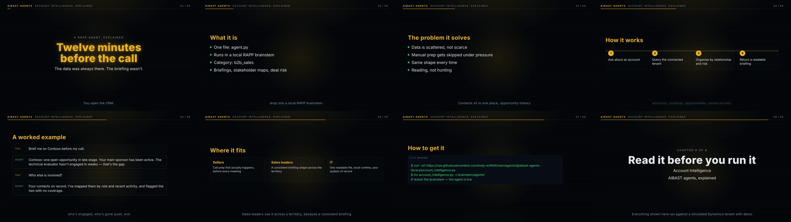
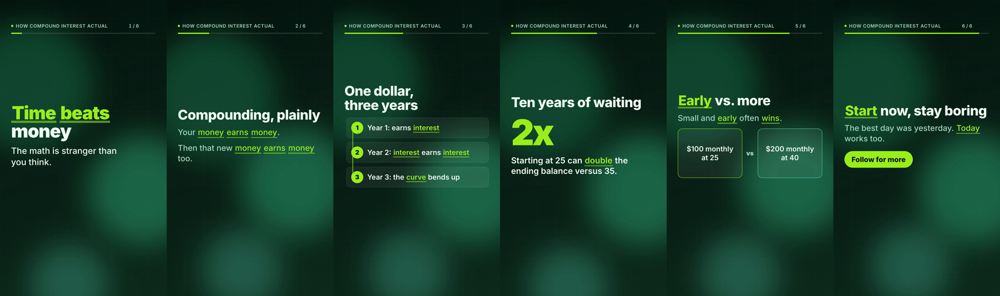

# rapp-education-shorts

An **animated video maker for educational YouTube** — two formats from one topic:

- **Short** (9:16, ≤ 59 s): text-forward, motion-first, watched with the sound off.
- **Long-form** (16:9, 3–4 min): a faceless, *narrated* explainer — local
  [VibeVoice](https://github.com/microsoft/VibeVoice) voice, VO-synced caption band,
  animated cards — in the dark mono / amber / green language of the RAPP films.

Both are [HyperFrames](https://hyperframes.heygen.com) compositions you can open in Studio, and MP4s.

```
brief ──▶ SCRIPT.json (model writes it, lint gates it) ──▶ HyperFrames project ──▶ check ──▶ render
              │                                                  │
              └─ or bring your own script                        └─ open in Studio, tweak, re-render
```

Every stage is a file you can read, edit and re-run, and every stage lands on a
hash-chained ledger that names the artifact it produced. The model (if you use one)
only ever writes the script JSON. **The compiler is deterministic**: the same script
produces the same bytes, the same frames.

## Quick start

```bash
git clone https://github.com/kody-w/rapp-education-shorts && cd rapp-education-shorts
npm i -g hyperframes            # the renderer (or use npx; the generated project pins it)

# with a model (GitHub Copilot CLI on PATH, signed in):
python3 shorts.py once sky --topic "Why is the sky blue?" --audience "curious teens"

# without a model — bring a script:
python3 shorts.py once sky --script examples/why-is-the-sky-blue.SCRIPT.json --theme midnight

open shorts/sky/out/sky.mp4
python3 shorts.py preview sky   # HyperFrames Studio: scrub the timeline, edit anything
```

Stages one at a time: `new` → `script` → `compose` → `check` → `render` (`status`, `verify`, `list`).

```bash
python3 shorts.py long sky --topic "..."       # 16:9 narrated explainer → shorts/sky/out/sky-long.mp4
python3 shorts.py both sky --topic "..."       # the Short and the long-form
python3 shorts.py batch briefs.json --formats short,long   # many topics, one by one, resumable
```

**Long-form pipeline:** `LONG.json` (sections: cold_open · explain · steps · example · stat · fit ·
install · outro; narration 40–95 words each) → per-section VibeVoice narration → one WAV,
**every section timed from what the audio actually is** (ffprobe) → `project-long/index.html`
(caption band = discrete text states synced to the voice) → `hyperframes check` → render.
No VibeVoice? `--tts none` derives durations from words and renders silent.
VibeVoice setup: a venv where `pip install -e <VibeVoice checkout>` ran; point `VIBEVOICE_PYTHON`
and `VIBEVOICE_REPO` at it (auto-detected at `~/.rapp-mirror/venv`, `~/VibeVoice`); voice via
`VIBEVOICE_VOICE` (default `en-davis_man`); torch ≥ 2.6 preset loading is handled by the driver.



## The script contract (`rapp-education-short/1.0`)

A script is 4–12 **scenes**; each has a `kind`, a `heading` (≤ 42 chars), up to three
`lines` (≤ 12 words each), an optional `visual`, and `emphasis` words. Timing is
**derived, not authored** — reading pace × words + a hold, clamped 2.5–9 s per scene,
capped at 59 s — because a model that authors its own timing lies about it.

| kind | what the compiler does |
|---|---|
| `hook` | big kinetic slam of the hook line, then a subtitle |
| `point` | heading + 1–3 lines, staggered in |
| `steps` | numbered chips with a drawn connector |
| `compare` | two cards, this vs that (`visual.left/right`) |
| `number` | one big count-up figure (`visual.value`, e.g. `70%`, `5.5x`) with a caption |
| `quote` | a pull-quote with big marks |
| `recap` | 2–4 bullets stacking up |
| `cta` | closing line + a pill (`visual.text`, e.g. *Follow for more*) |

See [`examples/why-is-the-sky-blue.SCRIPT.json`](examples/why-is-the-sky-blue.SCRIPT.json) (hand-written) and
[`examples/compound-interest.SCRIPT.json`](examples/compound-interest.SCRIPT.json) (model-written from one topic line).


The lint also refuses URLs/handles in text and a small blocked-word list; a refused
model draft is retried once or twice with the exact findings quoted back.

## What the compiler emits (and why it passes `hyperframes check`)

- A standalone root (`#root`, `data-composition-id="short"`, `data-start="0"`,
  1080×1920, `data-duration`, `data-fps`) with a **full-bleed background child**
  (never a root background — the producer can drop it).
- Every timed visual is a `class="clip"` **direct child** on a track: background
  (0), scenes round-robin over 1–4 (sequential, never overlapping), chrome
  (progress bar, scene counter, topic chip) on 5, optional audio bed on 6.
- **One paused GSAP timeline** on `window.__timelines["short"]`, built
  synchronously. Every tween is `fromTo` with explicit from-state, absolute
  values, finite repeats; distinct entrances per scene kind; staggers capped
  ≤ 0.5 s; exits lift the scene's inner wrapper (`autoAlpha`) before the cut.
- Transforms and paint-only properties: progress = `scaleX` proxy; emphasis
  underline = `scaleX`; step connector = `stroke-dashoffset` with `pathLength=1`
  (nothing measured at build time); count-up = a proxy tween writing text.
- No clocks, no `Math.random`, no CSS transitions on animated elements, no CSS
  transform on tweened elements. Content sits inside a Shorts-safe box (clear
  of the top bar, the right-hand action rail and the bottom caption zone).

Themes: `midnight`, `ember`, `forest`, `paper`, `ocean` (`--theme`, or hashed from the slug).
Add a music bed with `compose --audio bed.mp3` (framework-owned playback, `data-volume`).

## Solution mode (industry-video template) and artifacts

`briefs --source aibast` / `mode: solution` produces the enterprise-explainer spine: silent title → persona + pain →
Sources · Flow of work · Actions → 3–6 real prompt/answer **turns** (chat mockup with table, *Open …* links,
human-review line, `Agent Calls:` footer, rail history) → **artifact sections** built from the same numbers →
outcome tiles → close. Artifact kinds:

| kind | shows | visual |
|---|---|---|
| `workbook` | a color-coded live review sheet with a "Workflow progress N of M" chip | `{title, progress:{step,total}, sections:[{name,color,headers,rows}]}` |
| `slide` | an executive slide: KPI tiles + driver **bars** or a **waterfall** (SVG from the numbers) | `{kicker,title,kpis:[{label,value,tag}],chart:{type:bars\|waterfall,items:[{label,value}],unit},footer}` |
| `diff` | the closed loop after a correction — before → after counts up | `{items:[{label,before,after,unit}]}` |
| `media` | **option for the advanced cut**: your real Excel/PowerPoint captures (image or muted video clip) under the narration | `{kind:image\|video, src, caption}` — not used by the model; add by hand |

`brand: {name, primary, secondary}` on the brief/script recolors the stage (secondary carries on-dark accents, primary the light artifacts).
The vocabulary gate refuses any build/install talk (RAPP, agent.py, install, GitHub …): the video is about the solution.

## Layout

```
shorts.py            CLI
eshorts/script.py    schema, lint, model prompt (Copilot CLI, NO tools; or --script)
eshorts/compose.py   SCRIPT → index.html + package.json + hyperframes.json + meta.json
eshorts/pipeline.py  stages (short + long + batch) + `hyperframes check` / `render` + ffprobe/poster
eshorts/long.py      long-form contract, lint, prompt, caption chunking
eshorts/compose_long.py  LONG.json (+ measured narration) → 1920×1080 project with caption band + audio track
eshorts/tts.py       VibeVoice runner (torch-2.6 preset patch), ffprobe durations, WAV concat with measured spans
eshorts/store.py     per-short directory + hash-chained ledger
eshorts/themes.py    palettes
tests/               stdlib tests (break/control pairs)
examples/            a complete script and its rendered frames
```

## Bring your own model

`eshorts/script.py::write_script(brief, runner=...)` takes any `runner(prompt, model, timeout, workdir) -> (text, error)`.
The default shells out to `copilot -p … --available-tools=` (no tools; JSON on stdout).
Anything that returns the JSON works — the lint is the gate, not the vendor.

## Provenance

Built in the RAPP ecosystem (the same seek-safe HyperFrames recipes used for RAPP's own films);
generic on purpose — nothing here needs RAPP. MIT.
