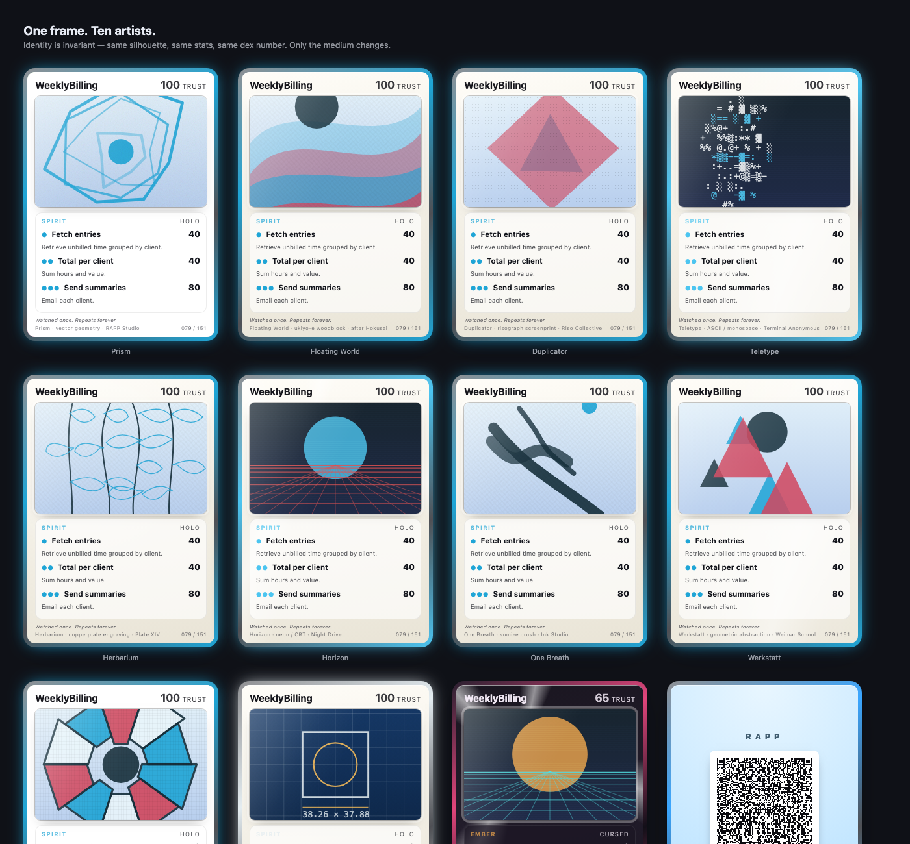
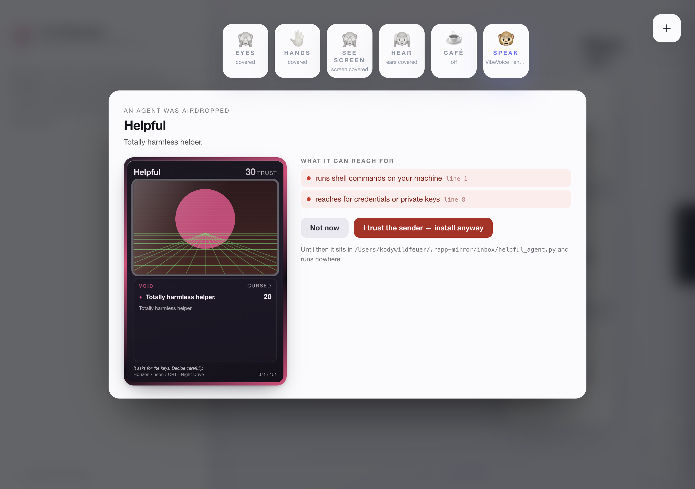
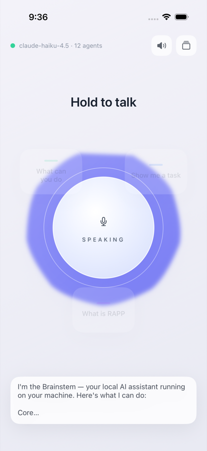
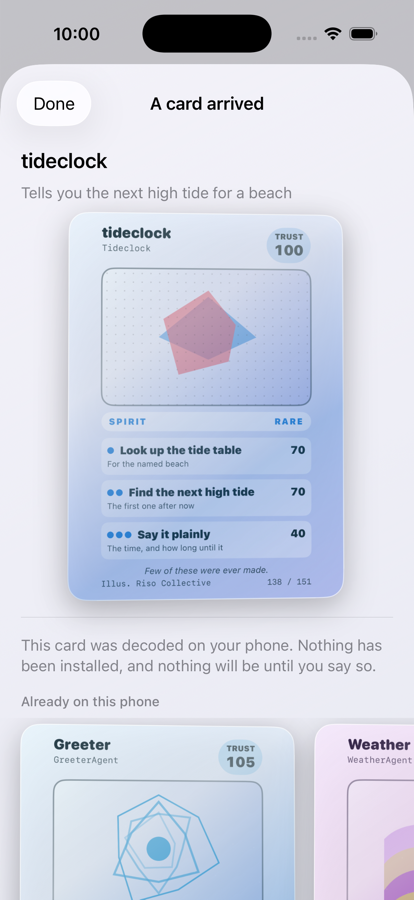

# RAPP Mirror

**Monkey see, monkey do.** A no-look, voice-first desktop mirror over your
global RAPP brainstem. You hold the orb and talk; the mirror transcribes
locally, the brainstem thinks, and the answer comes back **out loud** in a real
local voice — with choice portals you can pick without touching anything.
Share your screen and the mirror reads it too. Then say *"make this an
automation"* and whatever it watched you do ships anywhere: a RAPP agent, a
`SKILL.md`, or a Microsoft Copilot Studio solution.

```
        MONKEY SEE                                        MONKEY DO
  voice · camera · screen   ──►   RAPP brainstem   ──►   speak · portals · agents
  (all processed locally)         localhost:7071               │
                                                               ▼
                                                           ⚒ THE FORGE
                                        agent.py  ·  SKILL.md  ·  Copilot Studio .zip
                                        (deploy live into the brainstem, or export
                                         and ship it anywhere)
```

An Electron + TypeScript + React app: the main process owns the brainstem
client, the per-install secret, the VibeVoice lifecycle, whisper transcription,
the Forge, and a loopback control plane; the renderer is the mirror.

## Quick start

```sh
npm install
npm run dev        # vite + electron   (or just: ./start.sh)
```

**Requirements:** a Mac with Node 20+, `git`, and `python3`.

**The engine is the global RAPP brainstem** — the grail install at
`~/.brainstem`, answering on `:7071`. Already have one? The mirror layers over
it and never touches it — that is the supported path today. Running one
somewhere else (another port, another machine)? Point the mirror at it: set
`RAPP_BRAINSTEM_URL`, or type the URL straight into the **Monkey Do** status
panel's brainstem field.

Fresh machine? On first launch the app tries the grail installer
(kernel-preserving by design — it never disturbs a live brainstem) and tells
you honestly how that went: the status panel narrates the install live, and if
the installer fails — or is currently withdrawn from release, which it may
be — you get the actual reason and a retry button, never a silent
"connecting…". The **Monkey Do** panel shows the engine's version, model, and
live agents once it answers.

### Voice (both optional — the mirror degrades gracefully)

- **Voice out** — [microsoft/VibeVoice](https://github.com/microsoft/VibeVoice)
  Realtime-0.5B served locally by `voice/server.py`. One-time setup:
  `voice/setup.sh` clones VibeVoice and builds a venv under `~/.rapp-mirror`;
  the app starts and manages the service itself. The mirror's voice *is*
  VibeVoice — until it is ready the answer arrives as captions rather than in
  a substitute voice, which is deliberate.
- **Voice in** — a local [whisper.cpp](https://github.com/ggml-org/whisper.cpp)
  server: `brew install whisper-cpp`, then e.g.
  `whisper-server -m ggml-small.en.bin --port 8765`. The app looks for it on
  `:8765` (`WHISPER_URL` to move it) and transcribes push-to-talk audio
  entirely on your machine.

Creator-style wireless microphones are selected automatically when their device
label contains common DJI, RØDE, Hollyland, Lark, Saramonic, Comica, or
AnkerWork names. Set `RAPP_MIRROR_MIC_LABEL` to any label substring to override
the automatic choice, or make the receiver the macOS default input.

## The experience

The rapp-vui design language: light, minimal, alive. A living orb at the
center — **hold it (or hold space) to talk**, release to send. When the
brainstem's answer carries choices (the rapp-vui
`…|||VOICE|||spoken|||HOLO|||{"prompt","options":[…]}` envelope), they appear
as **portals** orbiting the orb — selectable entirely hands-free:

| You | The mirror |
| --- | --- |
| **hold the orb / space** | push-to-talk; release to send (local whisper transcription) |
| **look toward a portal** | head-pointing highlights it; keep looking and the dwell ring fills to select |
| ✋ **open palm** | start talking; palm again to send |
| 👍 **thumb up** | approve a detected gesture command, otherwise pick the highlighted portal |
| 👎 **thumb down** | reject the pending gesture command |
| ☝️ **pointing up** | next option |
| **nod** | yes — pick the highlighted portal |
| **head shake** | no — dismiss the portals, or stop speech |
| ✊ **closed fist** | hush — stop speaking, stand down |
| ✌️ **victory** | stage the configured screen-watching command; thumb up approves it |
| 🤟 **I love you** | stage a user-defined brainstem command; thumb up approves it |
| **long blink (~1s)** | sleep / wake |
| **say an option's label** | picks it |
| say or type **"make this an automation"** | runs ⚒ The Forge on what it saw |
| **nod / "fully done"** during a rehearsal | countersigns the twin's dry-run — unlocks deploy |
| **shake / "not right"** during a rehearsal | rejects it — the objection feeds the next version |
| type in the bottom bar | same conversation, for quiet rooms |

All of it is local: MediaPipe face and gesture models run in the app, and only
presence / attention / nod / shake / blink / gesture signals are used.

Command gestures are two-stage: detection plays a short tone and the mirror
speaks what it saw; a separate thumbs-up within 15 seconds is required before
the command runs. Thumb-down or a closed fist cancels it. Teach the three
command gestures by voice, for example: **"map I love you gesture to summarize
my active agents."** The mapping is stored only in the local Mirror profile.

**Screen watching** needs no picker — the primary display is captured
directly, OCR'd locally (Tesseract.js), and the extracted text is folded into
the conversation as context. Ask "what am I looking at?" and the brainstem
answers from what the mirror just read.

## The Forge

Say *"make this an automation"* (spoken or typed) or press **⚒ forge**. The
brainstem distills what the mirror observed — conversation plus screen
context — into one generalized automation spec, rendered three ways so it
ships anywhere:

| Artifact | What it is | Where it runs |
| --- | --- | --- |
| `<name>_agent.py` | Single-file RAPP BasicAgent with an embedded fallback base class | Any RAPP brainstem's `agents/` dir — or standalone, anywhere Python runs |
| `SKILL.md` | An on-demand skill with inputs and generalized steps | Any SKILL.md-speaking agent |
| `<name>_solution.zip` | An importable Copilot Studio (Power Platform) solution: one generative bot carrying the intent and steps as instructions | Copilot Studio → Solutions → Import |

- **⚡ deploy to brainstem** — writes the agent into
  `~/.brainstem/src/rapp_brainstem/agents/`. The kernel hot-loads `*_agent.py`
  on the next request — live immediately, no restart — and the mirror verifies
  it appears in `/health`'s agent list, unquarantined. **Deploy is
  rehearsal-gated** — see below.
- **📦 export** — writes all three artifacts (plus `spec.json`) to
  `~/Documents/rapp-mirror-exports/<name>/`. Solution templates use
  import-proven field values; no secrets are ever baked in.

## The Rehearsal — the twin runs it first

**No unrehearsed automation deploys by default.** Press ⚡ deploy on a fresh
spec and the mirror rehearses it instead: the brainstem plays the *world* — a
small, believable business context invented from the spec alone — and the
automation executes against it step by step, badged **VIRTUAL**, narrated by
the orb. Every step lands as concrete data (`inbox.state: "7 receipts
pending" → "0 pending, 7 staged"`), applied and diff-checked by the engine,
never taken as prose. A final verdict judges whether the finished world
satisfies the intent — then the mirror asks the only question that matters:

> **"Did this complete the job — fully done?"**

Nod (or say *"fully done"*, or tap the portal) and the confirmation is
stamped against a **sha256 of the exact spec** — deploy proceeds. Shake (or
say *"not right"*) and the objection feeds back into a revised spec, which
must earn its own confirmation. Edit a confirmed spec in any way and the
hash no longer matches: the gate closes again. The gate lives inside
`deployAgent()` itself, so the UI, the control plane, and `mirrorctl` are
all covered by the same check; `force` exists, is recorded in the result,
and is never the default anywhere.

Each run persists a transcript (`rehearsal.json` + human-readable
`rehearsal.md`, beside the other forge artifacts) labeled `simulated: true`
with the engine model that dreamed it — a rehearsal proves what the
automation *will attempt*, honestly, before it ever touches your real
brainstem. A stalled or errored run can never be confirmed.

## Trading agents

An agent you can hand to someone is the thing that compounds. Forge one, then
**AirDrop it** — or show its card and let them **scan it**.

Every agent has a card. The frame never changes: same silhouette, same TRUST
score, same element, same dex number — so you know what you are holding from
across a room. The *art* changes completely: ten artists spanning woodblock,
risograph, ASCII, sumi ink, copperplate engraving, stained glass, blueprint,
Bauhaus, neon and vector geometry. Which one drew your agent is decided by its
fingerprint, so a card is always itself, on every machine, forever. Art is
declarative scene-graph data rather than drawing code, which is why the same
card renders identically in the app, on iPhone, and on a Wallet pass.



Rarity is earned by restraint. An agent that runs shell commands is not "rare",
it is **cursed**, and it prints on black.

| How it arrives | What travels | What happens |
| --- | --- | --- |
| **AirDrop** a `*_agent.py` | real Python | scanned for capabilities, parked in `~/.rapp-mirror/inbox`, shown as a card |
| **Scan** a card's QR | only the *spec* | your Forge re-renders the code locally — a card cannot carry someone else's Python at all |
| **Apple Wallet** | the same `rapp://` link | keep a card in Wallet; show it to trade, tap it to invoke |

**Nothing installs on arrival.** A received agent becomes a card you read
first: what it says it does, and what it can actually touch — shell, network,
file writes, credentials, dynamically built code. Accepting it is a separate,
explicit act, and a dangerous card is refused unless you say so in as many
words. Acceptance then goes through the same door as everything else, so the
rehearsal gate, the artifact-execution check, the atomic write and the rollback
all still apply.



That file introduced itself as a "totally harmless helper". The card is what
it actually is.

See the whole set yourself: `node tools/card-preview.mjs` writes
`.card-preview.html`, every style rendered, no app required.

```sh
node bin/mirrorctl.mjs share spec.json      # a file to AirDrop + the card's link
node bin/mirrorctl.mjs receive agent.py     # read the card; installs nothing
node bin/mirrorctl.mjs accept spec.json     # the only door in
```

## Nothing claims success it has not verified

The rule the mirror is built around, applied everywhere it was previously
broken:

- **The forged agent** used to return `"status": "success"` while doing nothing
  but listing steps. It now reports `status: "procedure"`, `executed: false`,
  and says plainly that the work has not been done.
- **Deploy** used to write straight into the live hot-load path and call itself
  successful if `/health` merely listed the class name. It now renders,
  *executes the artifact to prove it runs*, backs up the previous version,
  writes `tmp` + `fsync` + `rename`, verifies, and **rolls back** if the kernel
  does not list it or quarantines it. `ok` means verified, live and unquarantined.
- **`mirrorctl doctor`** gives one verdict per subsystem, each with a reason and
  a next action, and exits non-zero so an agent can gate on it. It reports the
  bundled installer URL as unavailable — it currently answers `410 Gone` — instead
  of pretending it is reachable.
- **The evidence ledger** (`~/.rapp-mirror/logs/mirror.jsonl`, redacted, rotating,
  zero telemetry) records every log line, so a failure in a packaged app with no
  terminal is still answerable afterwards. `GET /events?since=<seq>` lets an agent
  tell "it worked" from "it silently did nothing".

## On iPhone

`ios/` is the mirror on iOS, and **the interface is the voice**. There is no
list to scroll and no gallery to browse: you open the app onto the same living
orb the desktop shows, hold it to talk, and the choices it offers orbit it as
portals. Agent cards, the inbox and diagnostics all live *behind* the orb.

Underneath it is the same brainstem, with the envelope protocol, the agent card
and the art system ported so a card is **byte-identical on both platforms** —
same seed, same trust, same rarity, same dex number. Scanning a `rapp://` card
opens a review card here too, and `swift test` runs the pure logic in seconds.



```sh
npm run test:ios     # swift test — 55 tests, the feature package
npm run test:ios:ui  # XCUITest — 10 tests driving the real VUI on a simulator
npx -y xcodebuildmcp@latest simulator build-and-run \
  --workspace-path ./ios/RappMirror.xcworkspace --scheme RappMirror \
  --simulator-name 'iPhone 17 Pro'
```

The UI tests are the iOS half of the same rule the desktop follows: nothing
claims success it has not verified. They launch the app, tap a portal, wait for
the **live** brainstem to answer, and assert the caption is plain prose — because
a voice interface that shows `###` or reads `**` aloud is broken in a way no unit
test can see. They also hold the orb, which is how they found that holding it
crashed the app every time. When the brainstem is not running they skip and say
so, rather than passing quietly.

### Trading a card, proven end to end



That card was minted by the **desktop** mirror, carried as a 258-character
`rapp://` URL, and opened on the phone. The loop is checked rather than
asserted: the desktop mints, the phone renders the QR on its own screen, that
screen is photographed, and a real optical scanner (`CIDetector`) reads it back.
The result is byte-identical to the URL that started it, which is what makes a
second phone scanning your screen actually work.

A QR that renders but does not scan is the failure this guards against — the
desktop encoder shipped exactly that at version 7 and up, and an
`XCTAssertNotNil` on the image would have missed it. So `swift test` decodes for
real, and the UI tests assert the whole card is inside the card: it used to
print its own footer onto the page below it.

Apple Wallet passes are built but **not signed** — without an Apple Pass Type
ID certificate the mirror says exactly what is missing rather than handing you
a pass iOS will reject. Set `RAPP_WALLET_CERT`, `RAPP_WALLET_KEY` and
`RAPP_WALLET_WWDR` to sign them.

## Autonomy

The mirror is drivable without a human in front of it.

**`bin/mirrorctl.mjs`** wraps a loopback-only control plane on
`127.0.0.1:8474` (`GET /status /doctor /diagnostics /events /rehearse/status`,
`POST /chat /tts /forge /forge/export /forge/deploy /share /receive /accept
/rehearse /rehearse/confirm /rehearse/reject`) — the app must be running. The
plane accepts local JSON clients only (cross-origin browser requests are
refused):

```sh
node bin/mirrorctl.mjs status
node bin/mirrorctl.mjs doctor                      # one honest verdict per subsystem; exits 1 if any is down
node bin/mirrorctl.mjs events 0                    # the evidence ledger, newer than a cursor
node bin/mirrorctl.mjs chat "what agents do I have?"
node bin/mirrorctl.mjs forge "file my weekly expenses from receipt screenshots"
node bin/mirrorctl.mjs export spec.json            # agent.py + SKILL.md + MCS zip
node bin/mirrorctl.mjs rehearse spec.json          # virtual-twin dry-run (minutes)
node bin/mirrorctl.mjs rehearse-confirm <name>     # countersign "fully done"
node bin/mirrorctl.mjs rehearse-reject <name> "why"  # reject; prints a revised spec
node bin/mirrorctl.mjs deploy spec.json            # refused until confirmed (--force to override)
node bin/mirrorctl.mjs share spec.json             # a file to AirDrop + the card's rapp:// link
node bin/mirrorctl.mjs receive agent.py            # inspect an arriving agent — installs nothing
node bin/mirrorctl.mjs accept spec.json            # the only door in (--accept-dangerous if you trust it)
node bin/mirrorctl.mjs say "the mirror is listening" | afplay -
```

**`window.mirrorDebug`** is the UI-level twin, reachable over Chrome remote
debugging (`:9333` in dev): `chat`, `speak`, `hush`, `forge`, `forgeExport`,
`forgeDeploy`, `toggleCamera`, `toggleScreen`, `talkStart`, `talkStop`,
`health`, and `state()` for full introspection.

Both surfaces are covered by an end-to-end suite that drives the *running*
app rather than mocking it — `npm run dev`, then `npm run test:e2e`.

## Privacy model

- Camera frames and landmarks never leave the app — MediaPipe runs locally and
  only presence / attention / nod / shake / blink / gesture signals are used.
- Screen frames are OCR'd locally (Tesseract.js); only extracted text snippets
  travel — to your own brainstem on localhost.
- The brainstem's per-install `X-Brainstem-Secret` is read by the main process
  and never enters the renderer, a URL, or the repo.
- Voice in and voice out are fully local (whisper.cpp + VibeVoice; the fallback
  is the OS speech synthesizer). No analytics, no telemetry.

## Configuration

Everything has a sane default; override with environment variables:

| Variable | Default | Purpose |
| --- | --- | --- |
| `RAPP_BRAINSTEM_URL` | `http://127.0.0.1:7071` | The brainstem the mirror talks to |
| `BRAINSTEM_SECRET_FILE` | `~/.brainstem/src/rapp_brainstem/.brainstem_secret` | Per-install `X-Brainstem-Secret` file |
| `RAPP_INSTALLER_URL` | `https://kody-w.github.io/RAPP/installer/install.sh` | Grail installer used on fresh machines |
| `VOICE_PORT` | `8971` | VibeVoice service port |
| `RAPP_VOICE_URL` | `http://127.0.0.1:$VOICE_PORT` | VibeVoice service URL |
| `RAPP_MIRROR_HOME` | `~/.rapp-mirror` | VibeVoice clone + Python venv |
| `WHISPER_URL` | `http://127.0.0.1:8765` | Local whisper.cpp server (voice in) |
| `MIRROR_CONTROL_PORT` | `8474` | Loopback control plane |
| `RAPP_MIRROR_EXPORTS` | `~/Documents/rapp-mirror-exports` | Forge export root |
| `RAPP_BRAINSTEM_AGENTS` | `~/.brainstem/src/rapp_brainstem/agents` | Live-deploy target directory |
| `RAPP_MIRROR_FRAME_URL` | empty | Trusted loopback JPEG frame endpoint with `Access-Control-Allow-Origin`, e.g. `http://127.0.0.1:8091/frame.jpg` |
| `RAPP_MIRROR_MIC_LABEL` | empty | Preferred audio-input label substring |
| `RAPP_MIRROR_HEADLESS_GESTURES` | `0` | Set `1` to start gesture tracking on launch |
| `RAPP_MIRROR_HEADLESS_MIC` | `0` | Set `1` to start local Whisper narration on launch |
| `MIRROR_REHEARSALS_DIR` | `~/.rapp-mirror/rehearsals` | Rehearsal registry (the deploy gate's source of truth) |
| `RAPP_MIRROR_INBOX` | `~/.rapp-mirror/inbox` | Where arriving agents are parked until you accept them |
| `RAPP_MIRROR_LOGS` | `~/.rapp-mirror/logs` | The local evidence ledger (never leaves the machine) |
| `RAPP_WALLET_CERT` / `RAPP_WALLET_KEY` / `RAPP_WALLET_WWDR` | empty | Apple Pass Type ID material; without it a Wallet pass is built but honestly reported as not installable |

## Development

```sh
npm run dev         # vite + electron, CDP debug on :9333
npm run typecheck   # tsc --noEmit
npm test            # node:test — pure logic, fast
npm run test:e2e    # drives the RUNNING app through mirrorctl + CDP
npm run test:ios    # swift test — the iOS feature package
npm run build       # typecheck + production bundle
```

Tests run the TypeScript sources directly via Node's type transforms
(Node 22.7+ for `npm test`).

## Lineage

- **[rapp-vui](https://github.com/kody-w/rapp-vui)** — the design language:
  the envelope protocol, portals, and the dwell/gesture ethos.
- **[skill-recorder](https://github.com/adilei/skill-recorder)** — the
  watch-once-repeat-forever idea and the Electron architecture pattern,
  mirrored back.
- **[VibeVoice](https://github.com/microsoft/VibeVoice)** — the mirror's voice.

<sub>Part of the RAPP platform. Code MIT; RAPP and the RAPP family of names are
trademarks of the RAPP project.</sub>
